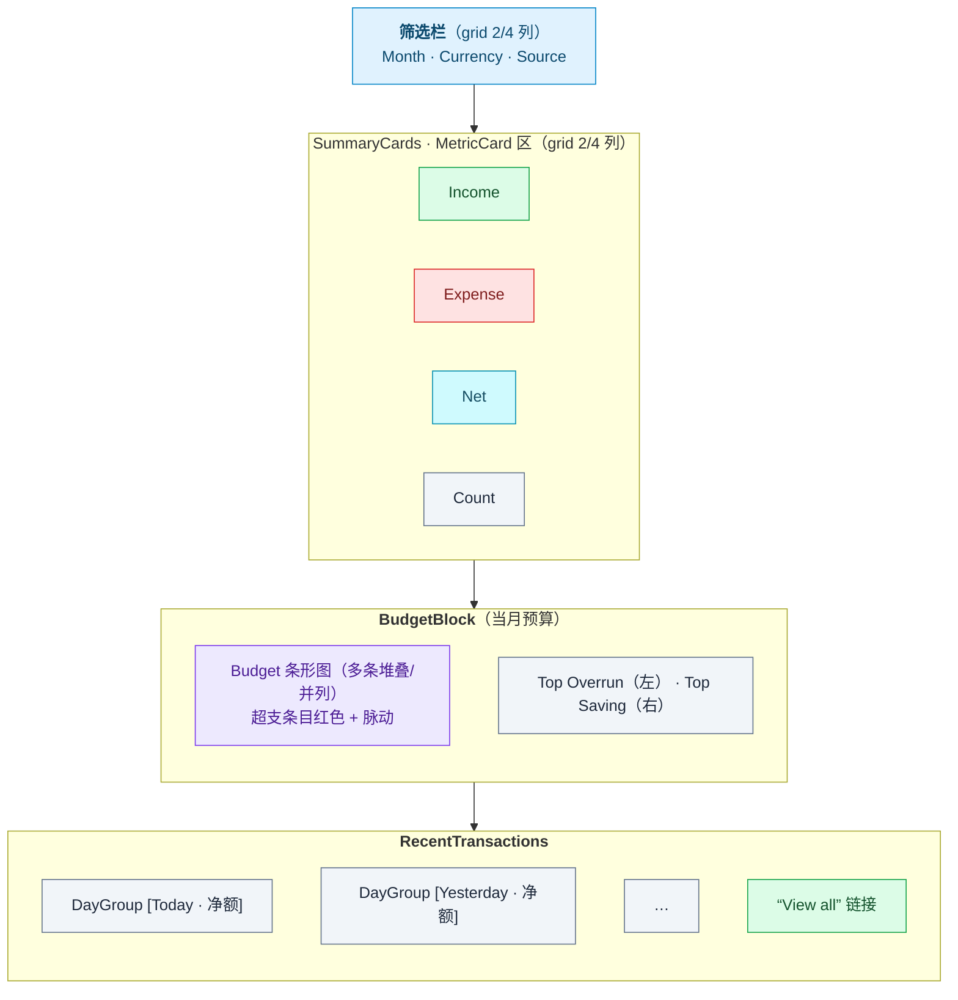
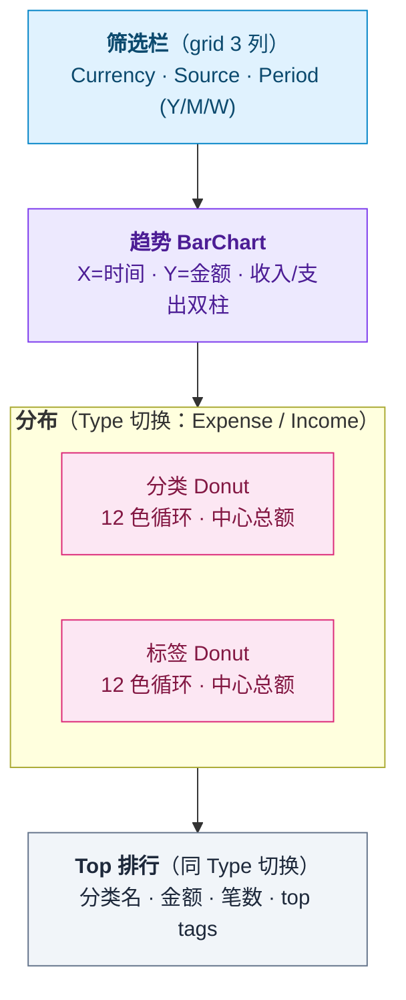
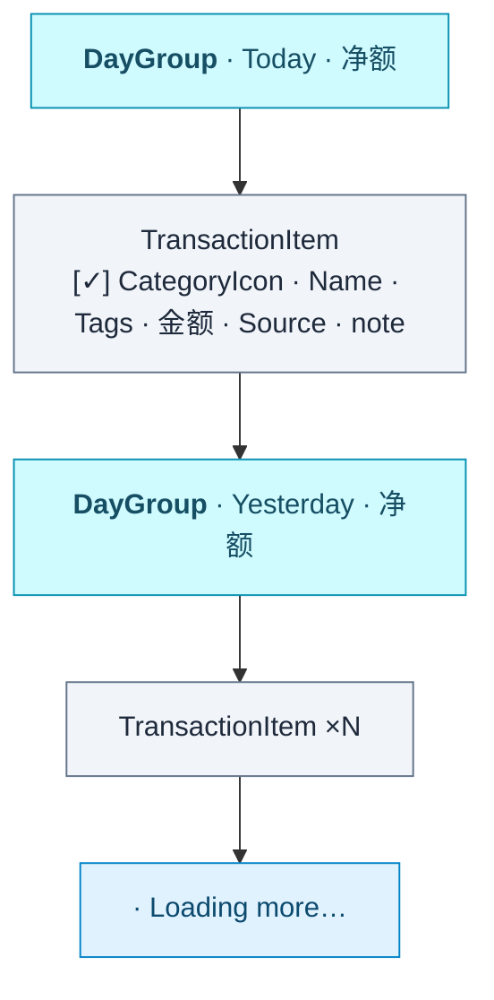
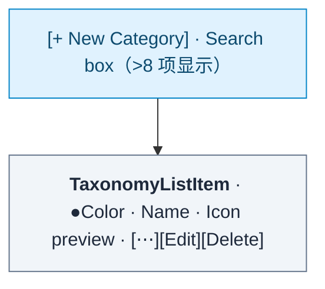
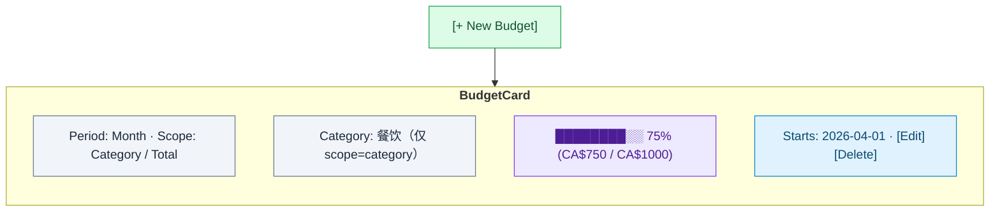
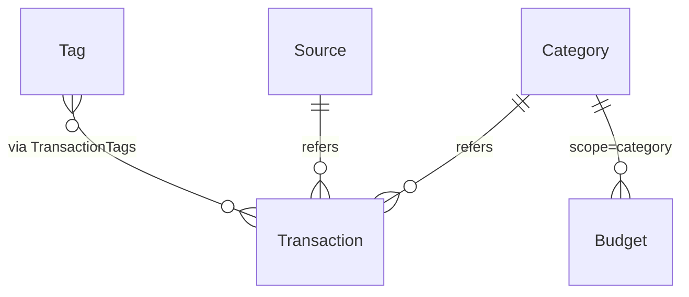

# SpendHarbor Local — 产品功能规格书（Product Spec）

> **目的**：本文是 SpendHarbor Local 版本的功能完整规格描述。任何工程师或 AI Agent 拿到本文档，应能据此从零重建一套功能完整、UI/UX 一致的应用。
>
> **产品形态**：本地离线 App，付费下载后终身使用，**不涉及任何登录、注册、会员、管理员、订阅或计费功能**。所有功能对所有用户全量开放。

---

## 目录

1. [产品定位与目标用户](#1-产品定位与目标用户)
2. [核心概念与术语](#2-核心概念与术语)
3. [信息架构与导航](#3-信息架构与导航)
4. [完整功能清单](#4-完整功能清单)
5. [详细 UI/UX 规格](#5-详细-uiux-规格)
6. [业务规则与边界](#6-业务规则与边界)
7. [视觉设计系统](#7-视觉设计系统)
8. [数据模型（用户视角）](#8-数据模型用户视角)
9. [国际化与本地化](#9-国际化与本地化)
10. [非功能需求](#10-非功能需求)

---

## 1. 产品定位与目标用户

### 1.1 一句话定位

**SpendHarbor Local** 是一款**本地离线**的个人记账 App，面向全球用户，提供中英双语、多币种、多账户、支出/收入管理，**所有数据仅存储在用户设备本地，零网络请求，零账户体系**，安全与隐私优先。

### 1.2 目标用户画像

- **主要受众**：苹果 App Store 与 Google Play 商店的全球付费用户
- **跨币种需求**：支持设置默认货币，覆盖全球主流货币（CAD/USD/CNY/HKD/JPY 等）
- **使用场景**：移动端随手记账（手机/平板为主）
- **隐私敏感型用户**：不愿将财务数据上传到任何云端服务

### 1.3 核心价值主张

1. **零摩擦记账**：移动端 FAB 一键添加，平板顶部按钮，无强制分类层级
2. **真正多币种**：每笔交易独立币种，统计分行展示，**不做汇率换算**（避免汇率波动失真）
3. **中英完整对等**：所有界面、错误信息均双语；默认分类按系统 locale 注入对应语言
4. **完全离线**：无网络请求、无后端服务、无账户系统；数据 100% 留在设备本地
5. **付费下载，终身使用**：一次性付费购买，所有功能全部解锁，无任何订阅、无内购、无配额限制

### 1.4 平台与形态

- **平台**：iOS、iPadOS、Android
- **形态**：原生/跨平台移动 App（手机端 + 平板端）
- **断点**：手机（<768px） / 平板（≥768px）
- **数据存储**：设备本地数据库（SQLite 或同等方案）+ 用户主动触发的本地文件导入/导出

---

## 2. 核心概念与术语

| 术语     | 英文         | 含义                                                           |
| -------- | ------------ | -------------------------------------------------------------- |
| 交易     | Transaction  | 一笔收入或支出，含金额、币种、分类、来源、日期、可选标签与备注 |
| 类型     | Type         | `income` / `expense`，决定颜色与符号                           |
| 分类     | Category     | 一级归类（如 餐饮、交通），与 type 绑定                        |
| 标签     | Tag          | 跨分类的横向标记（如 工作报销、和家人），多对多关联            |
| 来源     | Source       | 资金账户/支付方式（如 现金、信用卡、储蓄卡），含币种           |
| 预算     | Budget       | 在指定周期（周/月/年）和范围（总额/单分类）内的目标金额        |
| 默认项   | Default Item | App 内置的预设分类/标签/来源（`isDefault=true`）               |
| 自定义项 | Custom Item  | 用户创建或编辑后翻转的项（`isDefault=false`）                  |

> 不再涉及 User / Tier / Role / Admin 等账户类概念。App 启动后即为单一本地用户上下文。

---

## 3. 信息架构与导航

### 3.1 顶层路由表

| 路径                              | 页面                       | 加载策略 |
| --------------------------------- | -------------------------- | -------- |
| `/onboarding`                     | 首次启动引导（一次性）     | lazy     |
| `/`                               | Dashboard（仪表盘，首页）  | 主 chunk |
| `/stats`                          | 统计分析                   | lazy     |
| `/transactions`                   | 交易列表                   | lazy     |
| `/transactions/new`               | 新建交易                   | lazy     |
| `/transactions/:id/edit`          | 编辑交易                   | lazy     |
| `/transactions/recycle-bin`       | 回收站（30 天软删除）      | lazy     |
| `/settings`                       | 设置中心入口               | lazy     |
| `/settings/profile`               | 个人偏好（昵称、头像）     | lazy     |
| `/settings/categories`            | 分类管理（列表）           | lazy     |
| `/settings/categories/new`        | 新建分类                   | lazy     |
| `/settings/categories/:id/edit`   | 编辑分类                   | lazy     |
| `/settings/tags`                  | 标签管理（列表）           | lazy     |
| `/settings/tags/new`              | 新建标签                   | lazy     |
| `/settings/tags/:id/edit`         | 编辑标签                   | lazy     |
| `/settings/sources`               | 来源管理（列表）           | lazy     |
| `/settings/sources/new`           | 新建来源                   | lazy     |
| `/settings/sources/:id/edit`      | 编辑来源                   | lazy     |
| `/settings/budgets`               | 预算管理（列表）           | lazy     |
| `/settings/budgets/new`           | 新建预算                   | lazy     |
| `/settings/budgets/:id/edit`      | 编辑预算                   | lazy     |
| `/settings/export`                | 数据导出                   | lazy     |
| `/settings/import`                | 数据导入                   | lazy     |
| `/settings/backup`                | 备份与恢复                 | lazy     |
| `/settings/currency`              | 默认货币                   | lazy     |
| `/settings/language`              | 语言切换                   | lazy     |
| `/settings/appearance`            | 外观（浅色/深色/跟随系统） | lazy     |
| `/settings/security`              | 应用锁（PIN/生物识别）     | lazy     |
| `/settings/about`                 | 关于、版本、致谢           | lazy     |
| `/settings/legal`                 | 隐私政策、服务条款         | lazy     |

> 无需鉴权守卫。首次启动若 onboarding 未完成，全局 redirect 到 `/onboarding`；完成后所有路由可访问。

### 3.2 移动端导航（<768px）

- **顶部 header**：固定 64px，左侧应用标题/当前页面名，右侧次要动作（如筛选、设置入口）
- **底部 tab bar**：固定，4 个 tab：Dashboard / Stats / Transactions / Settings
  - active tab 用 `--color-action`（#10b981）高亮
  - 安全区适配：`pb-[env(safe-area-inset-bottom)]`，兼容 iPhone notch
- **FAB（浮动新增按钮）**：右下，距离底部 tab 上方 72px + safe-area，点击跳转 `/transactions/new`
  - 圆形，背景 `--color-action`，白色 `+` 图标

### 3.3 平板端导航（≥768px）

- **顶部 header（sticky）**：64px 高
  - 左：Logo + "SpendHarbor"
  - 中：水平菜单（Dashboard / Stats / Transactions）
  - 右：
    1. "+ Add transaction" 按钮
    2. 语言切换器（"EN · 中文"，当前语言加粗）
    3. 设置入口图标
- **设置页**：左侧 sidebar（260px）+ 右侧主区

### 3.4 响应式断点

| 名称    | 阈值    | 用途                        |
| ------- | ------- | --------------------------- |
| default | <640px  | 手机竖屏                    |
| `sm:`   | ≥640px  | 大手机/小平板               |
| `md:`   | ≥768px  | 平板（导航分界线）          |
| `lg:`   | ≥1024px | 大屏平板/桌面外接           |

---

## 4. 完整功能清单

按模块组织。所有特性对所有用户全量开放（付费下载终身使用，无任何配额/会员/订阅区分）。

### 4.1 首次启动与本地初始化

- ✅ 首次启动展示一次性 Onboarding（语言选择、默认货币选择、简介引导）
- ✅ 自动根据系统 locale 注入默认分类 / 标签 / 来源
- ✅ 默认分类、标签、来源均可被用户编辑或删除
- ✅ 个人偏好（昵称、头像 initials/本地图片）可在设置中修改，仅用于本地展示
- 🚫 不涉及任何注册、登录、OAuth、邮箱、密码、Token、Session、设备会话

### 4.2 交易管理

- ✅ 新建交易：金额、币种、类型（收/支）、分类、来源、日期、标签（多选）、备注
- ✅ 编辑交易
- ✅ 单笔删除（软删除，可在「回收站」恢复 30 天）
- ✅ 批量选择（长按 500ms 进入选择模式）
- ✅ 批量删除 / 批量改分类 / 批量替换标签
- ✅ 按月份切换查看（◀ ▶ 按钮，URL/路由参数同步）
- ✅ 按分类/标签/来源筛选
- ✅ 关键词搜索（备注、分类名、标签名）
- ✅ 无限滚动加载（IntersectionObserver / 列表虚拟化 + cursor 分页）
- ✅ 按天分组（DayGroup），显示当日多币种净额
- ✅ 标签使用频次统计（近 30 天，按降序排序，用于表单标签快捷区）
- 🚫 交易附件上传 / 重复账单 / 转账（账户间）/ 拆分交易（不在 MVP 范围）

### 4.3 分类、标签、来源、预算（Taxonomy）

- ✅ 分类 CRUD（与 type 绑定）
- ✅ 标签 CRUD（跨分类）
- ✅ 来源 CRUD（含币种字段）
- ✅ 预算 CRUD（周/月/年；总额/单分类）
- ✅ 编辑默认项时自动翻转为自定义项
- ✅ 同名去重（大小写不敏感）
- ✅ **无配额限制**：分类 / 标签 / 来源 / 预算 / 单笔标签数 / 月交易数均不设上限（仅受设备存储能力限制）
- ✅ 软删除策略；删除分类自动级联软删除依赖该分类的预算
- ✅ 预算周期对齐（week 周一对齐 / month 1 号 / year 1月1号，本地时区）

### 4.4 仪表盘（Dashboard）

- ✅ 月份切换 + 货币切换 + 来源切换（三个下拉）
- ✅ 4 张指标卡：收入 / 支出 / 净额 / 交易数
- ✅ 当月预算块（条形图，超支动画 `budgetPulse` 1.04× 脉动）
- ✅ Top Overrun（超支前 N） / Top Saving（结余前 N）
- ✅ 近期交易列表（最近 50 条，DayGroup 分组）
- ✅ 截断提示（"View all" 跳转完整列表）

### 4.5 统计分析（Stats）

- ✅ 趋势图（Bar Chart）：周期支持 week / month / year
- ✅ 分类分布（Donut Chart）
- ✅ 标签分布（Donut Chart）
- ✅ Top 交易排行（按分类聚合，含 top tags）
- ✅ 类型切换（支出/收入）
- ✅ 货币 + 来源筛选
- ✅ 点击 Donut 分片跳转交易列表（带筛选参数）

### 4.6 数据导出

- ✅ Excel 导出（.xlsx）
- ✅ CSV 导出
- ✅ 列：金额 / 币种 / 日期 / 分类 / 标签 / 来源 / 备注
- ✅ 多标签时英文逗号拼接
- ✅ 表头按当前 App 语言双语切换
- ✅ **任意日期范围**（无 30 天限制）
- ✅ 导出文件保存到系统分享面板（iOS Share Sheet / Android Intent），由用户自行选择保存位置或分享应用

### 4.7 数据导入

- ✅ 支持导入此前从本 App 导出的 .xlsx / .csv / .json 备份文件
- ✅ 导入预览：展示将新增多少笔交易、是否有冲突
- ✅ 三种合并策略：「全部追加」/「跳过重复」/「覆盖同 ID」
- ✅ 导入失败时按行展示错误，允许用户修正后重试

### 4.8 备份与恢复

- ✅ 一键全量备份（导出为单个加密/未加密的 `.shbak` 或 `.json` 文件）
- ✅ 一键全量恢复（覆盖当前数据前必须二次确认）
- ✅ 备份内容包含：交易、分类、标签、来源、预算、偏好设置
- ✅ 可手动选择保存到 iCloud Drive / Google Drive / 文件应用 / 本地相册（通过系统分享面板，App 自身不上传任何数据）
- ✅ 可设置「提醒备份」周期（关闭 / 每周 / 每月），到期在 App 内顶部提示，用户主动触发

### 4.9 设置中心

- ✅ 个人偏好（昵称、头像 initials/本地图片）
- ✅ 默认货币（影响新建交易表单的预填值）
- ✅ 语言切换（EN-US ⇄ ZH-CN）
- ✅ 外观主题（浅色 / 深色 / 跟随系统）
- ✅ 应用锁：可选启用 PIN 码 + 生物识别（Face ID / Touch ID / 指纹）
- ✅ 法律页（隐私政策、服务条款）
- ✅ 关于页（版本号、构建号、致谢、第三方依赖许可）
- ✅ 反馈入口（直接调起系统邮件应用，预填收件人；不在 App 内发送）

---

## 5. 详细 UI/UX 规格

### 5.1 首次启动 Onboarding

- 全屏分步引导（最多 3 步）：欢迎 → 选择语言 → 选择默认货币
- 每步右上提供「Skip」按钮，跳过后采用系统 locale + CAD 作为默认
- 完成后直接进入 Dashboard，**不再出现**（写入本地标记 `sh:onboarded=true`）

### 5.2 Dashboard（`/`）

#### 布局



> 容器：`max-w-[1200px]`

#### MetricCard 视觉

- 卡片：白底，圆角 `rounded-xl`，浅边框
- 顶部：图标（HandCoins/ShoppingBag/Wallet/ListChecks）+ 标签（小字灰）
- 底部：大数字（24px，monospace）+ 货币代码（小字）
- 颜色：
  - Income → `--color-income` (#19c17d)
  - Expense → `--color-expense` (#f06262)
  - Net → `--color-action-ink` (#064e3b)
  - Count → 中性灰

#### BudgetBlock 交互

- 每条预算一个进度条，已用 < 100% 时绿色，超支时红色 + 脉动
- 显示 "X% (used / total currency)"，超支显示 "+overage"
- Top Overrun / Saving：2 列网格，每列最多 5 条

#### RecentTransactions 交互

- 单击：跳转该交易编辑页（注意：在 Dashboard 不进入选择模式，长按选择仅在 `/transactions` 列表页生效）

### 5.3 统计分析（`/stats`）

#### 布局



#### 区块字段与交互

| 区块       | 字段 / 交互                                               |
| ---------- | --------------------------------------------------------- |
| 筛选栏     | Currency · Source · Period 三者联动                       |
| 趋势       | 收入柱（绿）/ 支出柱（红）；点击柱 → Tooltip 显示日期范围 |
| 分类 Donut | 点击分片 → 跳转交易列表（带分类筛选）                     |
| 标签 Donut | 点击分片 → 跳转交易列表（带标签筛选）                     |
| Top 排行   | 行点击 → 跳转交易列表                                     |

#### 周期粒度

- `year` → X 轴月份；近 12 月
- `month` → X 轴日期；当月
- `week` → X 轴日期；近 4 周或近 28 天

### 5.4 交易列表（`/transactions`）

#### 顶部栏（两态切换）

| 状态   | 左         | 中                  | 右                           |
| ------ | ---------- | ------------------- | ---------------------------- |
| 默认态 | `[← Back]` | `[◀] YYYY年M月 [▶]` | `[Filtered]`（有筛选时显示） |
| 选择态 | `[Cancel]` | `N selected`        | `[Done]`                     |

#### 列表区



#### 选择态底部栏

固定在视口底部，提供：`[ Delete (N) ]`（红色） / `[ Change Category ]` / `[ Replace Tags ]`

点击 Delete 触发确认对话框：`"Delete N transaction(s)?"` · `[Cancel]` `[Confirm Delete]`

#### 进入编辑

非选择态下单击 → 跳 `/transactions/:id/edit`，并通过路由 state 传递交易对象，避免重复查询数据库。

### 5.5 交易表单（`/transactions/new` & `/edit`）

#### 字段顺序

1. **类型分段控件**：[ Expense | Income ]，切换后过滤可选分类
2. **金额输入框** + 货币下拉：金额支持小数 2 位
3. **分类选择**：下拉，显示图标 + 名称
4. **来源选择**：下拉，显示图标 + 名称 + 币种
5. **日期选择**：日期选择器 + [Today] [Yesterday] 快捷按钮
   - 新建表单初始值：读取本地存储中 `sh:lastTransactedOn`（上次新建成功的日期），缺失或非法时回退到今天
   - 新建提交成功后回写该 key；编辑场景**不写入**，避免污染上次选择
   - 用途：连续补录历史交易时无需每次重选日期
6. **标签多选**：徽章式（彩色背景 + 白字）
   - 默认显示前 10 个（按近 30 天使用频次降序，未用过则按 createdAt 降序）
   - 超过 10 个显示 "+ More"，展开全部
   - 已选标签上方排（仅显示已选数，不限制上限）
7. **备注**：单行输入框，optional
8. **操作栏**：[Cancel] [Save]，保存中按钮 disabled + loading 文案

#### 验证规则

- 金额：必填，>0，最多 2 位小数
- 分类：必填，且 type 与表单类型一致
- 来源：必填
- 日期：必填，不能晚于今天 +30 天（防误填未来）
- 标签数：不设上限

#### 错误展示

- 字段下方红色文案（前端验证）
- 顶部 Banner（持久化层错误，例如磁盘写入失败）

### 5.6 设置中心子页面

#### 5.6.1 个人偏好（`/settings/profile`）

- 大头像（initials 或本地选择的图片，120px）
- 昵称输入框（≤80 字符，仅本地展示用）
- [Save] 仅在 dirty=true 启用
- 成功提示 1.8s 后自动消失

#### 5.6.2 分类/标签/来源管理

通用结构：



**TaxonomyFormDialog**（模态框）：

- Name 输入框
- IconPicker（网格 12 个常见图标）
- ColorPicker（8 色预设 + 自定义 hex 输入）
- Type（仅分类）：[Income | Expense]
- Currency（仅来源）：下拉
- [Cancel] [Save]

**默认项编辑**：保存时本地数据库将 `isDefault` 翻为 false，`nameKey` 清空。

#### 5.6.3 预算（`/settings/budgets`）



**BudgetFormDialog**：

- Period: [Week | Month | Year]
- Scope: [Total | Category]
- Category（仅 scope=category）：下拉
- Amount + Currency
- StartsOn（自动按 period 对齐）

#### 5.6.4 导出（`/settings/export`）

| 字段   | 选项                                       |
| ------ | ------------------------------------------ |
| Format | ● Excel (.xlsx) ○ CSV                      |
| Range  | ○ All ○ Custom（From / To）                |
| 操作   | `[ Export ]` → 调起系统分享面板            |

无任何范围或频次限制。

#### 5.6.5 导入（`/settings/import`）

- 文件选择按钮：调起系统文件选择器，仅接受 `.xlsx / .csv / .json / .shbak`
- 文件解析后展示预览：新增 X 条、可能重复 Y 条
- 合并策略单选：「全部追加」/「跳过重复」/「覆盖同 ID」
- `[ Cancel ] [ Import ]`，导入完成后展示结果摘要

#### 5.6.6 备份与恢复（`/settings/backup`）

| 区块         | 内容                                                                |
| ------------ | ------------------------------------------------------------------- |
| 立即备份     | `[ Create Backup ]` → 生成 `.shbak`，调起分享面板                   |
| 恢复         | `[ Restore from File ]` → 选择文件 → 二次确认 → 覆盖当前所有数据    |
| 备份提醒     | 频率：关闭 / 每周 / 每月                                            |
| 上次备份时间 | 显示本地记录的最近一次备份时间戳                                    |

#### 5.6.7 默认货币（`/settings/currency`）

| 字段             | 内容                                                 |
| ---------------- | ---------------------------------------------------- |
| Default currency | `▼ CAD · Canadian Dollar`                            |
| 说明             | "Used as the prefilled currency on new transactions" |
| 操作             | `[ Save ]`                                           |

#### 5.6.8 语言（`/settings/language`）

- 单选列表：English (US) / 简体中文
- 立即生效，无需重启

#### 5.6.9 外观（`/settings/appearance`）

- 主题单选：Light / Dark / System
- 实时预览

#### 5.6.10 应用锁（`/settings/security`）

- 开关：启用 PIN 锁
- 启用后设置 6 位 PIN（二次确认）
- 子开关：启用生物识别（Face ID / Touch ID / 指纹）
- 自动锁定间隔：立即 / 1 分钟 / 5 分钟 / 离开应用即锁
- 忘记 PIN：仅可通过「重置应用并清空所有数据」恢复（提供严重警告）

#### 5.6.11 关于（`/settings/about`）

- 应用图标 + 版本号 + 构建号
- 致谢列表
- 第三方依赖许可（可滚动列表）
- 反馈邮箱（点击调起系统邮件应用）

---

## 6. 业务规则与边界

### 6.1 配额

**无任何配额限制。** 付费下载即解锁全部功能。分类、标签、来源、预算、月交易数、单笔标签数、导出范围均不设上限，仅受设备存储容量与性能影响。

### 6.2 默认项规则

- App 首次启动时根据系统 locale seed 一组默认分类、标签、来源
- 默认项 `isDefault=true`
- 用户编辑默认项的 name/icon/color/sortOrder → 本地数据库将 `isDefault=false`，清空 `nameKey`
- 默认项可被删除（软删除）

### 6.3 同名去重

- 同一类型（categories/tags/sources）下，自定义项的名字大小写不敏感唯一
- 默认项不参与去重检查
- 冲突时表单字段下方红字提示 `NAME_EXISTS`，禁止保存

### 6.4 软删除策略

| 实体                    | 软删除 | 备注                                                      |
| ----------------------- | ------ | --------------------------------------------------------- |
| category / tag / source | ✅     | 查询自动过滤 `deletedAt IS NULL`                          |
| budget                  | ✅     | 删除分类时级联软删 scope=category 的预算                  |
| transaction             | ✅     | 在「回收站」保留 30 天后由本地后台任务物理清理            |
| transactionTags         | 物理   | 跟随 transaction 软删除，下次访问时不展示                 |

> 「回收站」入口位于 `/transactions` 顶部菜单，允许 30 天内恢复或立即彻底删除。

### 6.5 币种规则

- 全局支持币种白名单：`CAD, USD, CNY, HKD, TWD, JPY, KRW, SGD, AUD, NZD, GBP, EUR, CHF, INR, THB, MYR, PHP, VND`（共 18 种）
- 单一事实来源：`packages/shared/src/currencies.ts`（或客户端等价位置）
- **不做汇率换算**：跨币种统计永远分行展示

### 6.6 预算计算

- **scope=total**：当周期内（已对齐起点）的所有支出（不含收入）累计 vs amount
- **scope=category**：仅指定分类的支出累计
- 周期对齐（startsOn）：
  - `week` → 当前 ISO 周一（本地时区）
  - `month` → 当月 1 日（本地时区）
  - `year` → 当年 1 月 1 日（本地时区）
- 超支：百分比 > 100% 时 BudgetBlock 红色脉动；导出无影响

### 6.7 统计聚合

- **trend**：按 period 划分时间桶
  - `year` → 当年 12 个月桶
  - `month` → 当月日桶
  - `week` → 当周 7 个日桶
  - 空桶返回 0，前端正常渲染
- **distribution**：按 dimension（category/tag/source）聚合，返回 amount + percent
- **top**：按 category 聚合 amount + count，附 top 3 tags
- 所有 stats 计算的过滤参数：`currency`, `sourceId?`, `type?`

### 6.8 导入与冲突处理

- 仅接受本 App 导出的格式（含 schema 版本字段）
- 不同 schema 版本由内置 migrator 转换
- 三种合并策略：
  - **全部追加**：保留导入数据所有 ID，与现有数据合并；若主键冲突生成新 ID
  - **跳过重复**：依据 `(transactedOn, amount, currency, categoryName, sourceName, note)` 元组判定重复
  - **覆盖同 ID**：直接根据 ID 覆盖现有记录

### 6.9 错误码统一

本地错误统一形如 `{ code, message, details? }`：

| code                | 含义                                |
| ------------------- | ----------------------------------- |
| `VALIDATION_ERROR`  | 表单/字段校验失败                   |
| `NOT_FOUND`         | 本地记录不存在（多见于编辑已删项） |
| `NAME_EXISTS`       | 同名冲突                            |
| `IMPORT_PARSE_ERR`  | 导入文件解析失败                    |
| `BACKUP_WRITE_ERR`  | 备份文件写入失败                    |
| `STORAGE_FULL`      | 设备存储空间不足                    |
| `INTERNAL_ERROR`    | 兜底                                |

---

## 7. 视觉设计系统

### 7.1 颜色 Tokens

| 变量                    | 值        | 用途                                |
| ----------------------- | --------- | ----------------------------------- |
| `--color-primary`       | `#5b9bd5` | 备用主色                            |
| `--color-primary-hover` | `#3f80bc` | 备用主色悬停                        |
| `--color-income`        | `#19c17d` | 收入金额、收入柱                    |
| `--color-income-soft`   | `#dcfce7` | 收入背景                            |
| `--color-expense`       | `#f06262` | 支出金额、删除按钮                  |
| `--color-expense-soft`  | `#fee2e2` | 支出背景                            |
| `--color-mint`          | `#7ae8a6` | 装饰主绿                            |
| `--color-mint-soft`     | `#e8fbf1` | DayGroup 背景、卡片次背景           |
| `--color-mint-tint`     | `#cff5dd` | 边框、分隔线                        |
| `--color-bg-mint`       | `#f6fbf8` | 全局页面背景                        |
| `--color-action`        | `#10b981` | 主按钮、active tab、链接            |
| `--color-action-hover`  | `#059669` | 按钮悬停                            |
| `--color-action-ink`    | `#064e3b` | 标题色、强调文本                    |
| `--color-fg-soft`       | `#62686e` | 次要文本                            |

深色主题：在每个 token 基础上提供对应深色变体（具体值见设计标准文档）。

### 7.2 字体

```css
font-family:
  system-ui,
  -apple-system,
  "Segoe UI",
  Roboto,
  "Helvetica Neue",
  Arial,
  "PingFang SC",
  "Microsoft YaHei",
  sans-serif;
```

金额数字使用 `font-mono`（系统等宽字体），保证小数位对齐。

### 7.3 字号阶梯

| 类          | 像素 | 用途               |
| ----------- | ---- | ------------------ |
| `text-xs`   | 12px | 备注、来源名、徽章 |
| `text-sm`   | 14px | 列表正文、按钮     |
| `text-base` | 16px | 表单输入           |
| `text-lg`   | 18px | 卡片标题           |
| `text-xl`   | 20px | 区块标题           |
| `text-2xl`  | 24px | 指标卡数字         |
| `text-3xl`  | 30px | 页面 H1            |

### 7.4 圆角与阴影

- 圆形：头像、分类图标背景（`rounded-full`）
- 大圆角：卡片（`rounded-xl` = 12px）、模态框（`rounded-2xl` = 16px）
- 小圆角：徽章（`rounded-full` 配 px-2.5）
- 阴影：`shadow-sm`（卡片）、`shadow-lg`（下拉/模态）

### 7.5 间距规范

- 卡片内边距：`px-4 py-3`（列表项）、`p-4` 或 `p-6`（卡片块）
- 卡片间距：`space-y-4` 或 `gap-4`
- 网格 gap：`gap-3`（紧凑）、`gap-4`（标准）

### 7.6 动画

```css
@keyframes budgetPulse {
  0%, 100% { transform: scale(1); }
  50%      { transform: scale(1.04); }
}
/* 用于超支预算条形图，1s 循环 */
```

### 7.7 图标库

- 主图标库：`lucide-react`（或对应移动端等价库）
- 分类/标签/来源图标：自维护 `iconRegistry`（约 30 个常见 icon）

### 7.8 空态、Loading、错误态约定

- Loading：居中灰字 `loading...`；按钮内则改文案为 "Saving..." / "Loading..."
- Empty：居中灰字 + 可选行动按钮（如 "Add your first transaction"）
- Error：红色文本（`text-[color:var(--color-expense)]`）置于操作上方

---

## 8. 数据模型（用户视角）

> 本节描述用户感知的本地数据模型。完整 DDL（SQLite 或同等本地数据库）见技术文档。

### 8.1 实体关系总览



> 说明：Category / Tag / Source / Budget 均含 `default + custom` 两类；Budget `scope=total` 时不挂 Category。无 User 实体——所有数据隐式归属当前设备。

### 8.2 核心字段约束

- 所有金额：`numeric(14,2)`，正数（type 决定方向）
- 所有日期：本地时区解读，存为 ISO 字符串或日期类型
- 所有时间戳：本地时区或 UTC（实现层一致即可）
- 所有币种：18 种白名单 CHECK 约束
- 软删除：`deletedAt` 字段为空表示存活

### 8.3 数据生命周期

- **首次启动** → 在本地数据库中创建空表 + seed 默认 categories/tags/sources（按 locale）
- **删除交易** → 软删，30 天后由本地后台任务物理清理（也可在「回收站」立即彻底删除）
- **导入备份** → 按用户选择的合并策略写入
- **恢复备份** → 二次确认后清空并重建所有表
- **重置 App**（设置中提供入口）→ 清空本地数据库并回到首次启动状态

---

## 9. 国际化与本地化

### 9.1 支持语言

- `en-US` (English, United States/Canada)
- `zh-CN` (简体中文)

存储 key：本地存储 `sh.locale`，未设置时 fallback 到系统 locale，再 fallback 到 `en-US`。

### 9.2 切换 UI

- 设置中心：`/settings/language` 提供单选列表，立即生效
- 平板端 header 右侧亦提供快捷切换："EN · 中文"，当前语言加粗

### 9.3 资源文件结构

`apps/<client>/src/i18n/locales/{en-US,zh-CN}.json`，扁平 key（点分隔）。顶层命名空间：

| 命名空间        | 用途                                     |
| --------------- | ---------------------------------------- |
| `app.*`         | 应用名、slogan                           |
| `nav.*`         | 导航文案                                 |
| `dashboard.*`   | 仪表盘                                   |
| `transaction.*` | 交易列表、表单、批操作                   |
| `stats.*`       | 统计页                                   |
| `settings.*`    | 设置中心各子页                           |
| `errors.*`      | 业务错误码映射                           |
| `common.*`      | 共享文案（loading/empty/cancel/save 等） |

### 9.4 默认分类多语言注入

- App 首次启动时根据 `locale` 决定 seed 哪份默认分类
- 字段 `nameKey` 存 i18n key（如 `cat.food`），渲染时优先 `t(nameKey)` fallback `name`
- 用户编辑后翻为自定义，`nameKey` 清空

### 9.5 日期与数字格式化

- 日期：`Intl.DateTimeFormat(locale)`（或对应平台等价 API），DayGroup 显示 "Today" / "Yesterday" / 本地化日期
- 金额：保留 2 位小数，使用对应货币的 symbol 前缀（如 `CA$`, `US$`, `¥`）
- 货币 symbol 映射：见 `currencies.ts`

### 9.6 导出文件本地化

- Excel / CSV 表头依据当前 App 语言
- 导出文件名使用 ASCII：`spend-harbor-transactions-{from}-{to}.xlsx`，全部时为 `...-all-all.xlsx`

---

## 10. 非功能需求

### 10.1 性能

| 指标                            | 目标              |
| ------------------------------- | ----------------- |
| 冷启动到首屏（中端机型）        | ≤ 2.0s            |
| 本地查询 P50 / P95（无聚合）    | < 20ms / < 60ms   |
| Stats 聚合 P95（万级交易）      | < 300ms           |
| Excel 导出（10k 行）            | < 5s              |
| 移动端长按响应                  | 500ms 阈值        |

### 10.2 安全与隐私

- **零网络**：App 不发起任何对外网络请求（应用商店审核与崩溃上报除外，崩溃上报需用户在设置中明确开启）
- **本地存储**：数据库文件存放于 App 沙盒目录，受系统级文件保护
- **应用锁**：可选 PIN + 生物识别，自动锁定后须解锁方可使用
- **数据加密**（可选）：备份导出 `.shbak` 时提供「使用密码加密」选项（AES-256-GCM，密码不存储，遗失无法恢复）
- **SQL 注入**：本地数据库访问全部使用参数化查询
- **XSS**：渲染层默认转义，禁用任意 HTML 注入入口
- **无第三方追踪**：不嵌入任何分析/广告/追踪 SDK

### 10.3 隐私合规

- 由于不收集、不传输任何用户数据，无需 GDPR / PIPEDA 申报数据处理者义务
- 隐私政策仍需在应用内明示「本 App 不收集、不上传任何用户数据」
- 应用商店隐私清单（Apple Privacy Manifest / Google Data Safety）：勾选「不收集任何数据」

### 10.4 可访问性（A11y）

- 所有交互元素键盘/读屏可达
- 颜色对比度：正文 ≥ 4.5:1，大字 ≥ 3:1
- 表单字段均有 label 关联
- 纯图标按钮提供无障碍标签（FAB、删除按钮等）
- 支持系统动态字体放大

### 10.5 平台兼容

| 平台    | 版本     | 支持级别 |
| ------- | -------- | -------- |
| iOS     | ≥ 15.0   | 全功能   |
| iPadOS  | ≥ 15.0   | 全功能   |
| Android | ≥ 8.0    | 全功能   |

### 10.6 可观测性

- 本地结构化日志：环形缓冲，最多保留最近 7 天、≤ 5MB
- 「关于」页提供「导出诊断日志」按钮，由用户手动分享给支持邮箱
- 不做远程上报

### 10.7 可维护性

- TypeScript（或对应平台）strict 全栈，禁 `any`
- ESLint + Prettier 统一
- 单元测试覆盖 service / quota / period 等纯逻辑
- E2E 覆盖核心 3 链路：首次启动 seed、记账、Dashboard 渲染

### 10.8 分发与版本

- 渠道：Apple App Store、Google Play
- 计费：一次性付费下载，**无内购、无订阅、无广告**
- 版本升级：通过应用商店常规更新；数据库使用版本化迁移脚本，升级时自动执行，失败时回滚并提示

---

## 附录 A：实现文件索引

按本文章节给出主要源文件索引（具体路径依实现平台而定，以下为参考结构）：

| 章节           | 主要文件                                                                          |
| -------------- | --------------------------------------------------------------------------------- |
| §3 路由 / 导航 | `apps/<client>/src/App.tsx`, `components/layout/AppShell.tsx`                     |
| §4.2 交易      | `src/modules/transactions/*`, `src/pages/transactions/*`                          |
| §4.3 Taxonomy  | `src/modules/taxonomy/*`, `src/pages/settings/{Categories,Tags,Sources,Budgets}*` |
| §4.4 Dashboard | `src/modules/dashboard/*`, `src/pages/Dashboard.tsx`                              |
| §4.5 Stats     | `src/modules/stats/*`, `src/pages/stats/*`, `components/charts/*`                 |
| §4.6 导出      | `src/modules/export/*`, `src/pages/settings/ExportPage.tsx`                       |
| §4.7 导入      | `src/modules/import/*`, `src/pages/settings/ImportPage.tsx`                       |
| §4.8 备份      | `src/modules/backup/*`, `src/pages/settings/BackupPage.tsx`                       |
| §6 业务规则    | `src/config/*`, `src/lib/period.ts`                                               |
| §7 设计        | `src/index.css` / `src/theme/*`                                                   |
| §8 Schema      | `src/db/schema.ts`, `src/db/migrations/*`                                         |
| §9 i18n        | `src/i18n/*`, `packages/shared/src/currencies.ts`                                 |

---

**文档版本**：v2.0（2026-05-12，Local 版重写：移除登录/会员/Admin/计费/网络相关内容，所有功能全量开放）
**维护者**：SpendHarbor 团队
**下次审阅**：每 Phase 结束时 review，确保描述与代码一致
